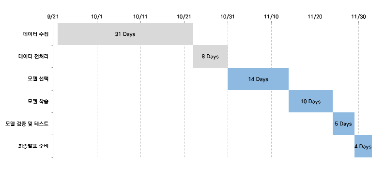
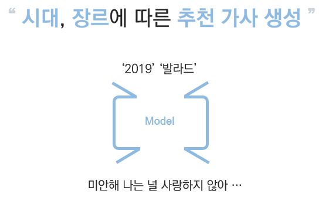

# SuperSenior_NLP_Project

- __팀 이름__ : SuperSenior
-  __주제__ : 시대, 장르에 따른 추천 가사 생성
- __개발일정__

## 팀원

 [임상균](https://github.com/ImSangKyun) 
 [이정인](https://github.com/jeongiin) 
 [염지현](https://github.com/yeomja99) 
 [김소현](https://github.com/sohyeon98720) 

## 상세내용

시대, 장르에 따른 추천 가사 생성기는 다음과 같이 "시대", "장르"를 입력하면 해당 시대와 장르에 맞춘 추천 가사를 생성해주는 모델입니다

